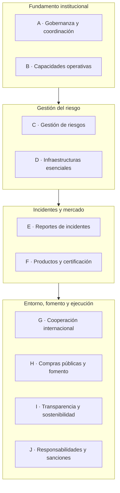

# Arquetipo legislativo de ciberseguridad — América Latina y el Caribe

Herramienta de **autoevaluación de la arquitectura legal** de una ley de ciberseguridad,
basada en un marco de **10 pilares, 59 subpilares y 177 ítems verificables**.

Tesis del marco: el reto regional es de **arquitectura jurídica coherente**, no de mera
ausencia de normas. Distingue **ciberseguridad (ex ante)** —gestión de riesgo, continuidad,
resiliencia— de **ciberdelito (ex post)** —persecución y sanción penal— y evalúa la primera.

Todo se genera desde una sola fuente de verdad: [`framework.yaml`](framework.yaml).

## Arquitectura del marco



Cada pilar agrupa subpilares (A1, A2, …) y cada subpilar, 3 ítems verificables.

## Artefactos

| Artefacto | Qué es | Dónde |
|---|---|---|
| **Navegador** | Sitio de referencia (solo lectura) de pilares, subpilares e ítems | `docs/index.html` → GitHub Pages |
| **Autoevaluación interactiva** | App web autocontenida; puntúa 0–4, calcula índices y radar en vivo, exporta JSON/CSV/PDF | `docs/autoevaluacion_ciberseguridad_ALC.html` |
| **Versión Excel** | Mismo instrumento en `.xlsx` con tablero y radar | `docs/…ALC.xlsx` y `dist/…ALC.xlsx` |

La app **no envía datos a ningún servidor**: corre por completo en el navegador, sin red.
Pensada para que un gobierno documente las brechas de su propia ley sin exponerlas a terceros.

## Estructura

```
cyber-arch-assessment/
├── framework.yaml            # FUENTE DE VERDAD (pilares, subpilares, ítems, tiers, fuentes)
├── build/
│   ├── loader.py             # carga el YAML
│   ├── build_workbook.py     # -> Excel
│   ├── build_webapp.py       # -> app web (usa webapp_template.html)
│   ├── build_navigator.py    # -> navegador (GitHub Pages)
│   ├── webapp_template.html  # plantilla de la app
│   └── generate_all.py       # regenera los tres
├── dist/                     # artefactos generados (Excel + app)
├── docs/                     # lo que sirve GitHub Pages (navegador + app + Excel)
└── requirements.txt
```

## Inicio rápido

```bash
pip install -r requirements.txt
python build/generate_all.py
```

Esto regenera `dist/` y `docs/` desde `framework.yaml`.

## Editar el marco

No edites el Excel, la app ni el navegador a mano: edita **`framework.yaml`** y regenera.

- Añadir/quitar un ítem → edita la lista `items` de ese subpilar.
- Cambiar la secuencia de adopción → ajusta el campo `tier` (`Núcleo` / `Intermedio` / `Avanzado`).
- Corregir una referencia comparada → campo `referencia_comparada`.

```bash
python build/generate_all.py   # vuelve a construir todo
```

## Publicar el navegador en GitHub Pages

1. Sube el repo a GitHub.
2. **Settings → Pages → Build and deployment → Deploy from a branch**.
3. Branch: `main`, carpeta: `/docs`. Guarda.
4. La URL queda como `https://jersain-llamas.github.io/cyber-arch-assessment/`.

## Metodología

**Escala de madurez (0–4)** — el nivel del subpilar es el promedio de sus ítems:

| Nivel | Etiqueta | Significado |
|---|---|---|
| 0 | Ausente | Sin base normativa |
| 1 | Disperso/implícito | Solo en normas penales/sectoriales/administrativas sueltas |
| 2 | Previsto no habilitante | Mencionado, sin ley especial ni competencias verificables |
| 3 | Establecido en ley especial | En la ley, con autoridad y deberes exigibles |
| 4 | Establecido y verificable | Además con métricas, plazos y trazabilidad |

**Dos lecturas** sobre los mismos datos:
- **Cobertura legal** = % de subpilares con promedio ≥ 3 (arquitectura legal; alcance del documento).
- **Madurez operativa** = % de subpilares con promedio = 4 (capa operativa; extensión).

**Notas.** El `tier` es una secuencia de adopción **propuesta y editable**, no del documento de
origen. Las referencias (NIS2, DORA, CRA, CER, Cyber Solidarity Act, Convenio de Budapest,
Chile Ley 21.663, etc.) son **anclas de redacción, no de copia literal**.

## Fuente

Llamas Covarrubias & Moliné Rodríguez, *Ciberseguridad en América Latina y el Caribe: hacia
una arquitectura legal y un marco común* (EU CyberNet / LAC4).

- 📄 [Documento (ES)](https://www.eucybernet.eu/wp-content/uploads/2026/01/ciberseguridad-en-america-latina-y-el-caribe.pdf)
- 📄 [Document (EN)](https://www.eucybernet.eu/wp-content/uploads/2026/01/ciberseguridad-en-america-latina-y-el-caribe-eng.pdf)

## Licencia

Código bajo MIT (ver [`LICENSE`](LICENSE)). La licencia del contenido del marco la define la
autoría del documento de origen.
